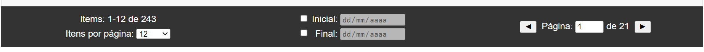

## Introdução:

Essa aplicação foi desenvolvida para cumprir um desafio lançado por meus instrutores da IBM. Tem como objetivo utilizar das boas práticas de desenvolvimento de software para criar uma aplicação que lê, salva e apresenta os dados da "Dívida Líquida do Setor Público (% PIB) do Banco Central
do Brasil".

A fonte de dados está disponível em [dadosabertos.bcb.gov.br]("https://dadosabertos.bcb.gov.br/dataset/4505-divida-liquida-do-setor-publico--pib---total---banco-central"). A série escolhida foi a de número 4505.

### Requisitos:
- Utilizar no projeto:
    - Java JDK 11+;
    - SpringBoot;
    - Banco de dados (MySQL, PostgreSQL ou outros);
    - Versionamento pelo Git;
- A aplicação deve buscar informações nas APIs da fonte
de dados e realizar a inserção em outra base de dados (processo de onboarding);
- Para essa nova base ter todos os verbos HTTP com suas respectivas operações CRUD. Sendo os principais:
    - Consultar dados da dívida líquida do setor público por ID;
    - Consultar dados da dívida líquida do setor público (todos os registros paginados);
    - Consultar dados da dívida líquida do setor público por filtro (dia, mês e ano);
    - Consultar dados da dívida líquida do setor público por ano e gerar soma acumulada no período de doze meses;
    - Salvar, atualizar e deletar registros da base de dados importada no processo de onboarding.
- Durante a apresentação utilizar uma ferramenta REST Client.
- Não obrigatório:
    - Organize suas atividades e seu código, tente usar metodologias e padrões de projeto de software;
    - Escreva testes unitários e de testes de integração (com cobertura acima 90% do código);
    - Utilizar o github para versionamento de código.

---

## O que foi feito:

Todos os requisitos obrigatórios do projeto foram cumpridos além dos seguintes adicionais:
- Endpoints extras:
    - Consultar por data inicial e data final;
    - Consultar últimos valores;
    - Somar todos os correntes anos;
    - Obter metadados da série.
- Um front-end com design responsivo para exibir os valores das séries com filtros por data e paginação que pode ser acessado pela página inicial da aplicação;
- Uma página de documentação com swagger ui que pode ser acessado pela página /docs ou /swagger-ui/;
- Obtenção de Metadados das séries através do banco central, dentre eles:
    - Nome completo da série;
    - Unidade de medida padrão;
    - Fonte.
- Fácil método de reuso da aplicação, podendo rodar com várias séries diferentes ao mesmo tempo sem que uma interfira na outra, não se limitando à série da dívida líquida do setor público.

### Dependências utilizadas:
- spring-boot-starter-data-jpa 2.6.7
- spring-boot-starter-web 2.6.7
- h2 2.1.212
- lombok 1.18.24
- spring-boot-starter-test 2.6.7
- spring-boot-starter-webflux 2.6.7
- htmlunit 2.61.0
- mysql-connector-java 8.0.29
- springfox-boot-starter 3.0.0
- springfox-swagger-ui 3.0.0

### Front-end

Todo conteúdo do front-end é configurado conforme a série escolhida automaticamente. Os metadados são obtidos pelo endpoint GET /serie.
Para filtrar os dados basta utilizar a barra abaixo dos valores da série.

Para utilizar o filtro por dada basta clicar no checkbox na frente do input de data e selecionar ou escrever a data necessária. Caso esteja escrevendo os valores de data pressione enter ao finalizar.
É possível pular para uma determinada página escrevendo a página no input de texto e pressionando enter.

### Endpoints
Endpoint | Descrição
-|-
**GET** ​/4505​/dados | Retorna valores paginados com parâmetros de paginação (page, size, sort), data inicial e data final<br />**Parâmetros não obrigatórios:** page=N, size=N, sort=nomeDaColuna,ASC ou DESC, dataInicial=dd/MM/yyyy, dataFinal=dd/MM/yyyy
**GET** ​/4505​/dados​/{id} | Retorna o valor do ID desejado
**GET** ​/4505​/dados​/data | Retorna valores com o filtro de dia, mês e ano<br />**Parâmetros não obrigatórios:** dia=dd, mes=MM, ano=yyyy
**GET** ​/4505​/dados​/soma | Retorna a soma de todos os anos ou de algum ano especificado como parâmetro<br />**Parâmetros não obrigatórios:** ano=yyyy
**GET** ​/4505​/dados​/ultimos​/{valores} | Retorna os últimos valores ordenados por data
**POST** ​/4505​/dados​/insert | Insere um valor no repositório
**DELETE** ​/4505​/dados​/delete​/{id} | Deleta um determinado ID do repositório
**PUT** ​/4505​/dados​/update​/{id} |Edita um determinado ID no repositório
**PATCH** ​/4505​/dados​/update​/{id} | Edita uma coluna de um determinado ID no repositório

Corpo necessário para POST, PUT e parcialmente necessário para PATCH:
```json
{
  "data": "dd/MM/yyyy",
  "valor": 0.0
}
```

### Configurações das Propriedades:

Para alterar a série utilizada do "Banco Central do Brasil - Departamento Econômico" basta altear o parâmetro da propriedade api-bcb-serie. Caso queira rodar mais de uma aplicação também é possível. Basta alterar o server.port também. O restante é configurado automaticamente.

```properties
#Propriedades do server e serviço
server.port=8080
api-bcb-serie=4505
```

Para alterar o profile da aplicação basta mudar a propriedade spring.profiles.active em application.properties:

```properties
#Profile atual
spring.profiles.active=dev
```

Com o profile "test" a aplicação utilizará um banco de dados H2, cujo as configurações podem ser alteradas em application-dev.properties. Com o profile "dev" a aplicação utilizará um banco de dados MySQL e suas propiedades podem ser alterados em application-dev.properties.